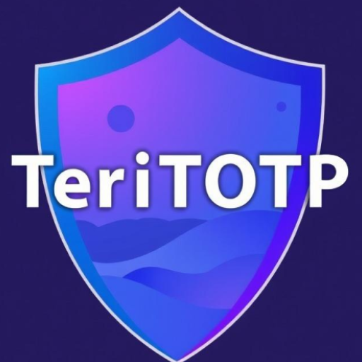

# TeriTOTP

**TeriTOTP** is an open-source, community-driven two-factor authentication (2FA) app created by an
enthusiast passionate about security and privacy. The app ensures transparency, allowing users to
contribute, inspect, and continuously improve the code.

## Features

- **Security First:** Your security and privacy are our top priorities. TeriTOTP is designed to keep
  your accounts secure with robust two-factor authentication.
- **Open Source:** Community-driven development ensures transparency and continuous enhancement.
  Contributions from the community are welcomed.
- **Account Export/Import:** Easily export your accounts in JSON format and import them whenever
  needed.
- **QR Code Sharing:** Share your account details with others via QR codes for convenient setup on
  other devices or other app.
- **Automatic Avatars:** Personal avatars for GitHub and Freelancehunt accounts are set up
  automatically. The ability to set custom avatars is also planned.

## Getting Started

1. **Download and Install:**
    - Download the latest version of TeriTOTP from the [official repository](https://github.com/Teri-anric/Teri-TOTP-android/releases).
2. **Add Accounts:**
    - Scan QR codes provided by your services.
3. **Export & Import Accounts:**
    - Export your accounts to a JSON file and import them whenever needed.
4. **QR Code Sharing:**
    - Share your account information securely via QR codes.
5. **Automatic Avatars:**
    - Your GitHub and Freelancehunt avatars will be set automatically.

## Contributing

TeriTOTP is open-source and contributions are always welcome! Whether you're fixing bugs, adding new
features, or improving documentation, feel free to open an issue or submit a pull request.

## License

TeriTOTP currently does not have a defined license. Please refer to the repository for any updates.
